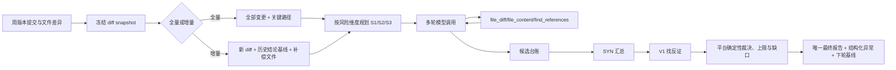

# AI 分析任务 E 优化与 Run 22/23 实测复核报告

> 日期：2026-09-22  
> 目标：复核 AI 版本风险分析的正确性、增量能力、上下文预算、token 成本、耗时、并发和可观测性，并给后续多个 AI subagent 一份可直接拆解执行的任务书。  
> 项目状态：平台尚未正式部署，不需要维持旧数据库、旧接口或旧任务数据兼容；如果新设计更清晰，可以直接改表、重建库和重做任务协议。

## 1. 结论与建议顺序

当前功能已经能从真实周版本 diff 生成有 QA 价值的风险报告，且主要读取 diff，并没有无节制地读取整表。Run 22 找到了协议 ID 位移、teamId 布局兼容、同名配表导出、非法日期、货币 ID、角色属性语义替换等具体风险。增量入口、全量入口、历史报告、逐轮用量、运行中统计隔离也已经能工作。

当前最大的质量瓶颈不是模型本身，而是“发现候选文件和查依赖”的平台能力：1012 个改动文件只把 200 个名字放进提示词，最终只取得 52 个文件的证据；`find_references` 又用顺序 `git show` 扫描，隐藏的共享 900 文件额度在 S1 阶段耗尽，后续分片 10 次搜索失败。把用户配置的提示词预算、轮次和索取次数继续调大，并不能解除这些硬限制，只会让对话历史与重复证据更贵。

因此建议按以下顺序处理：

1. 先实现确定性的全量 manifest、分片文件分配、引用索引和依赖闭包，扩大有效发现面。
2. 再让所有硬编码上限从“隐藏常量”变成“由有效预算推导、在 UI 可见、逐轮可审计”的运行计划。
3. 用独立金标评估召回率，在质量不下降的前提下压缩中间协议、共享证据和输出 token。
4. 完成预索引后再并行跑分片；否则并行只会更快地争抢同一个引用扫描额度。

## 2. 当前实现链路

关键模块：

| 领域 | 主要文件 | 当前职责 |
|---|---|---|
| 运行编排 | `services/ai_analysis_service.py`、`services/ai/subagent.py` | 冻结输入、分片、汇总、复核、落库 |
| 多轮引擎 | `services/ai/engine.py`、`services/ai/protocol.py` | 多轮请求、协议校验、上下文压缩、用量统计 |
| 上下文工具 | `services/ai/context_tools.py`、`services/ai/platform_provider.py` | diff、正文、提交、文档和引用搜索 |
| 增量基线 | `services/ai/snapshot_store.py`、`services/ai/change_set.py` | 快照、delta、补偿文件与历史结论 |
| 裁决报告 | `services/ai/verdict.py`、`services/ai/result_payload.py` | 找反证结果、置信度修正、唯一报告正文 |
| 任务与进度 | `services/ai/job_service.py`、`services/task_worker_task_handlers.py` | job/run 关联、持久进度、重启恢复 |
| 用量与费用 | `services/ai/usage.py`、`services/ai/pricing.py` | token、缓存、价格表和聚合口径 |

## 3. 本轮已经修复或补强的内容

### 3.1 运行与 UI

- 增量分析和全量重新分析已拆成两个按钮；增量按钮为绿色，默认可用，全量按钮为红色并受冷却约束。
- 运行中 job 与 run 建立显式关联；跨进程页面可从数据库中的 `progress_json` 读取逐轮进度，不再只依赖 Web 进程内存。
- 无变化复用能返回 `reused_run_id`；活动任务重复提交能附着到既有 run。
- 用量页不再因新任务运行而把历史缓存命中率和费用覆盖成“未上报”。实测 Run 23 运行中，页面继续显示历史 `84.1%`、`¥50.56`，并单独显示“1 个新任务运行中、临时 token 未计入”。
- 费用确认文本统一格式化，避免 JavaScript 把对象渲染成 `[object Object]`。

### 3.2 报告可信度

- 报告正文不再附带 `<!-- ai-verify-ruling: {...} -->` 机器 JSON；Run 22 最终正文 3864 字，未出现该注释。
- 模型草稿与平台最终裁决分开存储，面向用户只显示一份最终结论。
- 候选血缘按 `source_candidate_ids` 对账；Run 22 明确指出 `[S3-11] Boot.lua /exec` 未被汇总采纳，而不是静默丢失。
- diff hunk 证据定位已修复：完整的 `path @@ -old,count +new,count @@` 以及旧模型的 `path:diff@@ ... @@` 是固定 commit 上可复现的坐标，应视为可定位证据。旧代码误把 Run 22 的 3 条协议风险从 `very_high` 降为 `high`。新增回归测试同时拒绝缺路径、缺 old/new 坐标和散文式引用。
- 复核阶段因上限拒绝的条目与主分析阶段的条数上限项改用不同标题，并明确两组不是重复计数。
- 增量结果增加平台侧累积合并：旧问题不会再因模型本轮省略而消失；未变化文件直接延续，
  已变化文件在没有结构化反证时进入“需要重新确认”，相同问题的轻微标题漂移可保守关联。

### 3.3 任务 E 的测量基础

- 每份上下文有稳定 `chunk_id`。
- 工具维度新增：`avoided_duplicate_chars`、`cross_member_replayed_chars`、`unscoped_content_requests`。
- `find_references` 的 query 进入 trace，能解释一次扫描为什么发生。
- 基准导出器统一结构化字段与正文中的路径脱敏规则，移除了原来不可比较的 strict xfail。
- 生成金标模板时放在 `gold_templates/`，不会被 runner 误认为“0 条问题”的正式金标。

这些改动解决了“能不能测”的问题，还没有证明“token 降低且召回不降”。在独立金标建立前，不能把 token 下降本身当成功标准。

## 4. Run 22 全量实测

测试目标：`/weekly-version-config/1/diff`，两个仓库，真实模型 `deepseek-v4-flash`，3 个分析分片 + 汇总 + 对账。

### 4.1 总量

| 指标 | Run 20 | Run 22 | 变化 |
|---|---:|---:|---:|
| 变更文件 | 1009 | 1012 | +3 |
| 输入 token | 1,722,027 | 1,902,031 | +10.45% |
| 输出 token | 277,806 | 308,666 | +11.11% |
| 总 token | 1,999,833 | 2,210,697 | +10.54% |
| 缓存读取 token | 1,347,712 | 1,554,304 | 81.72% 输入命中 |
| 轮次 / 工具请求 | 26 / 131 | 29 / 128 | 轮次 +3，请求 -3 |
| 时长 | 26.60 min | 26.63 min | 基本不变 |
| 最终风险 | 19 | 20 | +1；另有上限淘汰和候选缺口 |
| 按当前价格表估算 | ¥3.2406204 | ¥3.4756428 | +7.25% |

价格表口径：未命中输入 ¥2/M、缓存输入 ¥0.2/M、输出 ¥8/M。Run 22 费用中约 ¥2.4693 来自输出，占约 71%；后续优化不能只盯输入缓存。

### 4.2 每个阶段

| 阶段 | 轮次 | 请求 | 输入 | 输出 | 缓存读取 | 上下文字符 | 截断 | 失败 | 耗时 |
|---|---:|---:|---:|---:|---:|---:|---:|---:|---:|
| S1 配表 | 7 | 37 | 500,316 | 84,273 | 399,360 | 131,207 | 5 | 1 | 5.86 min |
| S2 代码逻辑 | 7 | 37 | 455,407 | 56,939 | 368,256 | 166,184 | 10 | 5 | 4.08 min |
| S3 流程/耦合 | 8 | 34 | 648,516 | 86,938 | 548,992 | 224,714 | 9 | 5 | 6.45 min |
| SYN 汇总 | 2 | 5 | 76,106 | 33,012 | 53,120 | 25,920 | 1 | 0 | 2.19 min |
| V1 对账 | 5 | 15 | 221,686 | 47,504 | 184,576 | 76,153 | 2 | 2 | 3.56 min |

判断：

- S3 是最大消费者，输入和上下文都显著高于另外两个分片；它负责跨模块关系，不能直接按平均数削减，应先提供引用索引和依赖图。
- V1 只复核最严重的少数结论，却用了 269,190 总 token、5 轮、15 次请求，性价比偏低。适合先做确定性证据包，再把模型限制为“找反证 + 输出结构化裁决”。
- SYN 已从 Run 20 的 277,803 总 token 降到 Run 22 的 109,118，总结层压缩有效；节省被 S3 和 V1 增长抵消。
- 29 轮每轮都会重发历史，输入 token 远高于真实取回的 624k 左右上下文字符是预期现象，但仍有压缩空间。

### 4.3 diff 与整表使用

| 工具 | 调用 | 实际执行 | 缓存命中 | 失败 | 截断 | 产出字符 |
|---|---:|---:|---:|---:|---:|---:|
| `file_diff` | 98 | 63 | 35 | 0 | 27 | 543,613 |
| `file_content` | 14 | 14 | 0 | 2 | 0 | 76,550 |
| `find_references` | 15 | 14 | 1 | 10 | 0 | 913 |
| `read_reference` | 1 | 1 | 0 | 0 | 0 | 2,026 |

AI 有合理利用 diff：`file_diff` 调用数是 `file_content` 的 7 倍，正文字符也主要来自 diff。14 次整文件/整表读取里有 7 次没有先限定范围，仍应优化，但它不是成本主因。真正的浪费包括：

- 27 次 diff 单条截断，模型后续需要再次索取或在残缺证据上降置信度。
- 跨分片重复回放 168,746 字符；这是不同 agent 的上下文隔离造成的，不是同一个 agent 的简单重复调用。
- `find_references` 10 次失败，花了模型请求轮次却没有获得证据。
- 输出 token 308,666 偏高，中间轮 `reason` 经常是长篇分析，最终机器真正需要的是简短候选、下一批请求和证据 ID。

### 4.4 覆盖与质量边界

- 本轮输入清单有 1012 个文件，只展示 200 个文件名；实际取得证据 52/1012，即 5.1%。
- “其余文件仍可读取”在权限层面成立，但模型不知道未展示文件名时无法点名；只能先猜 commit 或调用 `commit_detail`。当前文案容易让用户高估发现能力。
- 20 条最终风险大多有具体文件、触发条件和 QA 回归建议，质量可用。
- 34 条分片候选中有 1 条没有血缘去向；另有 5 条虽被汇总引用，最终被上限、阈值或去重处置。
- Run 22 为 `degraded/subagent_gap`，不能把未覆盖区域解释成“没有风险”。
- 没有独立人工金标，因此不能用“最终条数从 19 到 20”证明召回率提高。两次模型运行的发现集合会自然波动。

## 5. Run 23 增量实测

Run 23 由绿色“增量分析”真实触发。平台识别到相对 Run 22 有 35 个 delta 文件，总窗口从 1012 增至 1020 个文件，并额外加入 20 个上一轮未取到证据的补偿文件；历史 Run 22 的 20 条结论作为基线进入分析。由于改动命中关键路径，运行记录的 `scope` 为 `full/critical_path_detected`，但发现输入仍以 35 个 delta 文件为主，并没有重新枚举 1020 个文件。这里的 `full` 表示风险裁决范围升级，不表示重新把整批文件送给模型。

### 5.1 总量与成本

| 指标 | Run 22 全量 | Run 23 增量 | 变化 |
|---|---:|---:|---:|
| 调查文件 | 1012 | 35 delta + 20 补偿 | 发现窗口显著缩小 |
| 输入 token | 1,902,031 | 1,357,606 | -28.62% |
| 输出 token | 308,666 | 335,841 | **+8.80%** |
| 总 token | 2,210,697 | 1,693,447 | -23.40% |
| 缓存读取 token | 1,554,304 | 1,102,336 | 输入命中率 81.20% |
| 轮次 / 工具请求 | 29 / 128 | 29 / 138 | 轮次不变，请求 +10 |
| 本轮新模型结论 | 20 | 5 | 其中 1 条与历史问题语义相同 |
| 覆盖 | 52/1012（5.1%） | 31/35（88.6%） | 增量发现面明显改善 |
| 按当前价格表估算 | ¥3.4756428 | ¥3.4177352 | 仅 -1.67% |

费用按“未命中输入 ¥2/M、缓存输入 ¥0.2/M、输出 ¥8/M”计算，输入 token 已包含缓存读取，不能把缓存 token 再按普通输入重复计费。Run 23 输出费用约 ¥2.6867，占总费用 **78.61%**。所以总 token 虽下降 23.4%，费用几乎没降；当前首要成本问题已经从输入转为长输出。

### 5.2 每个阶段

| 阶段 | 轮次 | 请求 | 输入 | 输出 | 缓存读取 | 上下文字符 | 截断 | 失败 | 记录耗时 |
|---|---:|---:|---:|---:|---:|---:|---:|---:|---:|
| S1 配表 | 6 | 31 | 296,393 | 81,603 | 229,248 | 80,176 | 2 | 0 | 5.92 min |
| S2 代码逻辑 | 7 | 33 | 341,594 | 80,986 | 295,936 | 86,391 | 5 | 0 | **372.88 min（含休眠）** |
| S3 流程/耦合 | 7 | 40 | 341,377 | 72,003 | 285,312 | 115,461 | 5 | 3 | 5.90 min |
| SYN 汇总 | 4 | 16 | 161,484 | 56,026 | 120,192 | 55,466 | 4 | 1 | 4.45 min |
| V1 对账 | 5 | 18 | 216,758 | 45,223 | 171,648 | 60,045 | 2 | 2 | 3.93 min |

测试机器在 S2 期间从 02:38 休眠到 08:38，Run 23 总 `duration_ms=24,051,683`（约 400.86 分钟）包含这 6 小时，不能与正常运行时长比较。进程唤醒后从原阶段继续执行并正常结算，说明任务没有被误判为僵尸；token、轮次、请求和报告质量不受这次墙钟污染。

阶段判断：

- 三个发现分片的输入从 Run 22 的 1,604,239 降到 979,364，缩小 diff 窗口是有效的。
- SYN 从 2 轮/33k 输出上升到 4 轮/56k，V1 仍使用 5 轮/45k 输出；两层合计 101,249 输出 token，超过任一发现分片。它们在反复复述候选与证据，是 Run 23 费用没有同步下降的主要原因。
- 29 轮与全量完全相同，138 次工具请求还多 10 次。当前“增量”主要减少每轮输入内容，没有减少决策层级和轮次上界。
- 在没有独立 QA 金标前，不建议直接减少 S1/S2/S3 的发现轮次。可以先压缩 SYN/V1 的协议字段、共享 evidence ID、限制重复论证，这些对召回的风险更低。

### 5.3 diff、整文件与引用搜索

| 工具 | 调用 | 实际执行 | 缓存命中 | 失败 | 截断 | 产出字符 | 跨分片回放字符 |
|---|---:|---:|---:|---:|---:|---:|---:|
| `file_diff` | 71 | 37 | 34 | 0 | 17 | 273,691 | 133,386 |
| `file_content` | 27 | 23 | 4 | 0 | 0 | 98,174 | 9,961 |
| `find_references` | 38 | 33 | 5 | 6 | 1 | 16,140 | 1,337 |
| `read_reference` | 2 | 2 | 0 | 0 | 0 | 9,096 | 0 |

AI 仍以 diff 为主：`file_diff` 调用 71 次，高于 `file_content` 的 27 次；31/35 个 delta 文件取得了实际证据。整文件读取不是主要浪费，但 27 次里有 8 次未限定范围，且调用数较 Run 22 的 14 次接近翻倍，说明模型在增量输入下仍会用正文补足被截断的 diff。

需要优化的不是禁止读整表，而是让工具返回“结构化 diff 摘要 + 可分页 hunk + 稳定 evidence ID”：17 次 diff 截断会迫使模型补读正文；跨分片又回放 144,684 字符。`find_references` 从 Run 22 的 15 次增加到 38 次，6 次失败，证明跨文件查依赖是有价值但平台供给不足，E2 的 snapshot 倒排索引仍是 P0。

### 5.4 增量基线实际缺陷与本轮修复

Run 23 首次结算时只落库 5 条本轮模型结论。虽然 20 条 Run 22 结论已经放进提示词，但平台把“模型这轮没有重复输出”错误地等同于“旧问题消失”，没有形成累计报告。这不是模型准确率问题，而是平台把状态合并责任交给了概率模型。

本轮已增加确定性累积合并层，并用 Run 22/23 的真实数据回放：

| 状态 | 数量 | 平台行为 |
|---|---:|---|
| 本轮重新确认 | 1 | 同文件、同类别，标题高相似；即使指纹因措辞漂移也合为同一问题 |
| 相关文件未变化，直接延续 | 18 | 保留原证据和人工处置，不要求模型重复花 token |
| 相关文件变化，需要重新确认 | 1 | 没有结构化反证时保持活动，不允许因模型省略而判定已修复 |
| 本轮真正新增 | 4 | 作为新风险加入累计清单 |
| 累计活动结论 | 24 | Run 23 页面、payload、异常表与下一轮基线使用同一集合 |

实现约束：只有“固定旧指纹命中”，或“同文件、同类别且标题相似度至少 0.72”的一对一匹配才算重新确认。相似度只用来关联身份，不用来判定已修复。当前协议还没有可靠的结构化 `fixed/rejected` 输出，所以平台采取保守策略：旧问题除非有明确反证，否则继续活动。后续应在 E4 中给 SYN/V1 增加 `baseline_fingerprint + baseline_status + evidence_ids`，才能把“已修复”也确定性落库。

### 5.5 报告与 UI 验收

- 原始 Run 23 报告 3951 字，未出现 `<!-- ai-verify-ruling: ... -->`；标准 hunk 解析修复已加载，正文没有“不可定位”误判。本轮最终 5 条恰好没有 hunk 坐标，因此这项以回归测试为主要证据。
- 累积合并回放后正文为 6079 字，异常表从 5 条变为 24 条；新增“历史结论延续（平台）”并说明重新确认、直接继承和待复核三种状态。
- 分片产生 18 条候选，其中 10 条没有进入 SYN 的最终清单，最终状态仍为 `degraded/subagent_gap`。平台正确暴露了缺口，但汇总漏采率偏高；E4 必须改为按 candidate ID 完整做取舍表，不能让 10 条候选只停留在报告末尾。
- 点击绿色增量按钮后任务直接启动，没有先显示 35 个 delta、20 个补偿文件、基线 Run 22 和升级原因；这仍不满足用户要求的“调用模型前选择”。E8 保持 P1，但交互实现应前移到 job 创建前，worker 只执行已经冻结的用户选择。
- 运行中用量页保持历史 `84.1%`、`¥50.56`，另显“1 个新任务运行中，临时 token 未计入”，符合要求；完成态在最终重启后复测。

## 6. hardcode 与用户配置审计

用户配置不是最终生效值。当前的关系如下：

| 项目 | 用户可配 | 隐藏约束 | 风险判断 | 建议 |
|---|---|---|---|---|
| 提示词字符预算 | 是，当前 560,000 | 取配置值与模型窗口 60% 水位的较小值；端点未声明时假设 1M token，即最多约 600,000 字，再扣平台提示词 | 大值会被隐式夹紧；UI 保存值与实际值可能不同 | 保存/预估时展示“配置值、模型窗口来源、生效值、平台开销、历史保留策略” |
| 最大分析轮次 | 是，当前 8 | 是**每个 agent** 8 轮，3 分片 + SYN + V1 最多是 5 组额度；格式修复还可能多一轮 | 用户容易误以为整次最多 8 轮 | UI 改名“每个分析角色最大轮次”，同时估算 job 上界 |
| 上下文索取上限 | 是，当前 40 | 是**每个 agent** 40 次，不是 job 总数 | 设置 100 可能产生接近 500 次调用 | 显示每角色与整单理论上界；支持角色级预算 |
| 文件名清单 | 否 | `MAX_LIST_CHARS=60,000`、`max_files=200` | 大版本中模型看不到多数名字 | 用完整 manifest/分页发现接口替代把名字塞进提示词 |
| 单次 `commit_detail` | 否 | 6,000 字 | 大提交会截断 | 由剩余预算与分页推导，保留稳定游标 |
| 单次 diff/content/reference | 否 | 11,000/11,000/11,000 字 | 用户提高总预算后单条仍经常截断 | 自适应到 11k~32k；由剩余预算、剩余请求、内容结构共同决定 |
| 单次引用结果 | 否 | 8,000 字、80 hits | 热点符号会裁掉尾部 | 返回按文件聚合的命中摘要和可翻页游标 |
| 引用扫描 | 否 | 每次最多 240 文件；provider 共享 `SearchBudget=900` | Run 22 中 S1 把额度用完，后续 10 次失败 | 建一次索引，搜索不再按请求重复扫文件；预算改为显式配置与指标 |
| 历史压缩 | 否 | 4,000 → 1,200 → 指针；至少保留最近 1 轮 | 总预算很大时仍可能因单项/历史规则丢上下文 | 按有效窗口比例推导；报告每轮压缩前后字符和被替换 chunk ID |
| trace 响应 | 否 | 4,000 字、40 items 等审计上限 | 不影响模型，但会妨碍事后定位长回复 | trace 大字段对象存储，DB 保留摘要与 hash |
| 输出 token | 否 | 客户端目前没有角色级输出上限 | 中间 `reason` 长，输出成本占 71% | 先缩协议字段与文案，再加 finish_reason 可观测和角色级软/硬上限 |

结论：硬编码本身并非都不合理。单元格长度、最短查询词、trace 展示长度等防御性边界可以保留。影响分析覆盖、模型调用次数或证据完整性的常量不能继续隐藏；它们必须成为运行计划的一部分，并且随用户预算和模型窗口推导。

## 7. 并发、性能与数据库

### 7.1 队列

同步任务和 AI 任务仍共用一个不可抢占 worker。优先级 aging 只能保证当前任务结束后 AI 先执行，不能打断已经运行十分钟的同步任务。Run 22 曾因此排队约 4 分钟。

建议拆成 `sync` 与 `ai` 两个独立队列/worker pool，并分别限制并发。调度表记录 `queue_name`、`lease_owner`、`heartbeat_at`，取消通过 cooperative cancellation 在每轮模型调用前、每批工具执行前检查。

### 7.2 分片并发

当前 S1/S2/S3 串行，便于复用进程内缓存，但总耗时约等于各阶段相加。正确的并行前提是：

1. 先冻结 snapshot；
2. 一次构建共享只读 evidence store 和引用索引；
3. 为每个分片确定性分配 manifest；
4. 并行执行模型调用；
5. SYN/V1 在所有分片完成后运行。

这样不会让三个分片重复 `git show`，也不会争抢进程内共享额度。若直接并行当前实现，搜索预算耗尽和 SQLite 写锁都会更严重。

### 7.3 数据库

当前 SQLite 适合本地单机验证，不适合作为多 worker 的最终方案。平台未部署，可以直接迁 PostgreSQL，job/run/trace 用短事务写入；长文本和完整模型响应放对象存储或压缩表。不要在模型网络请求期间持有数据库事务。

## 8. 面向多个 subagent 的实施任务

以下任务按文件所有权尽量减少冲突。所有任务都可以不兼容旧库；迁移困难时直接重建开发库。

### E0：独立 QA 金标与评估门禁（第一优先级）

**目标**：给任务 E 建立能判断“token 降了但召回没降”的标准。

**文件范围**：`scripts/export_ai_benchmark_sample.py`、新增 `scripts/evaluate_ai_benchmark.py`、`tests/fixtures/ai_benchmark/`、`docs/`。

**实现**：

- 从 Run 22/23 导出不可变 sample；至少两名 QA 独立标注，争议项仲裁。
- 金标记录 `finding_id/family/severity/file/evidence/trigger/expected_disposition`，不能只记标题。
- 指标至少包含 family recall、critical recall、evidence locatable rate、false positive rate、每发现 token、每有效证据 token、耗时和费用。
- 对模型随机性跑至少 3 次，报告均值、最差值和方差。

**验收**：任何预算优化只有在 critical recall 不下降、整体 recall 的置信区间不劣于基线、误报不升高时才能合入。金标不得由被测模型自己生成并直接当真值。

### E1：完整 manifest 与确定性分片（P0）

**目标**：消除“1012 个文件只展示 200 个名字”的发现盲区。

**文件范围**：`services/ai/change_set.py`、`services/ai/subagent.py`、`services/ai/prompt.py`，可新增 `services/ai/manifest.py`。

**实现**：

- prompt 只带分层摘要；完整 manifest 作为工具可分页读取。
- 先按仓库、文件类型、目录、提交、风险特征计算 deterministic assignment；每个文件至少属于一个发现分片，关键路径可进入两个分片。
- 记录 assigned/inspected/evidence 三层覆盖率。

**验收**：1000+ 文件样本中 assigned=100%，重跑分配稳定；任何未检查文件能追溯到分片、预算和原因。

### E2：snapshot 引用索引（P0）

**目标**：替换每次 `find_references` 顺序扫描最多 240 文件、全局最多 900 文件的实现。

**文件范围**：`services/ai/reference_search.py`、`services/ai/platform_provider.py`，新增索引模型/服务。

**实现**：

- snapshot 冻结后按 blob SHA 解码一次，构建 token→文件/行号的倒排索引；相同 blob 跨运行复用。
- 查询返回 total、scanned、matched、分页游标、索引版本。
- 二进制、无法解码和超大文件单独记缺口。

**验收**：Run 22 的 15 个 query 不再出现“共享扫描额度耗尽”；结果与穷举搜索一致；重复查询不再重复读取 Git blob。

### E3：有效预算运行计划（P0）

**目标**：让用户设置与实际行为一致，彻底回答“大预算为什么仍被截断”。

**文件范围**：`services/ai/budget.py`、`services/ai/context_tools.py`、`services/ai_analysis_service.py`、配置 API 与模板。

**实现**：

- 在任务创建前生成 `BudgetPlan`：configured/effective prompt chars、window source、agent 数、每角色 rounds/requests、job 理论上界、每工具 item cap、保留输出空间。
- 单条上限按 `remaining_effective_chars / remaining_requests` 自适应，默认下限 11k、上限先设 32k；结构化分页优先于截断。
- UI 保存大值时立即预览会被模型窗口夹到多少，不能等运行日志才提示。

**验收**：配置 2M 字但端点未声明窗口时，页面在运行前明确显示有效约 600k 减平台开销；每次截断都能说明命中了哪个独立约束。

### E4：紧凑中间协议与输出预算（P1，依赖 E0）

**目标**：降低占费用 71% 的输出 token，同时保留推理质量。

**文件范围**：`services/ai/protocol.py`、`services/ai/prompt.py`、`services/ai/llm_client.py`、`services/ai/engine.py`。

**实现**：

- 中间轮只允许 `requests`、短 `reason_code`、候选增量和 evidence IDs；长解释留在最终报告。
- 为 S1/S2/S3、SYN、V1 分别设置可观测的 soft output budget 和硬 `max_tokens`。
- 记录 `finish_reason`；被长度截断时走结构化 continuation，不把残 JSON 当正常结果。

**验收**：通过 E0 门禁；Run 22 样本输出 token 至少下降 25%，critical recall 与证据可定位率不下降。

### E5：共享 evidence store（P1，依赖 E1/E2）

**目标**：去掉 Run 22 中 168,746 字符的跨分片证据回放。

**文件范围**：`services/ai/context_tools.py`、`services/ai/engine.py`、新增 `services/ai/evidence_store.py`。

**实现**：工具返回稳定 `evidence_id/chunk_id`；分片输出引用 ID；SYN/V1 按需取证据摘要或原文，不把所有正文重新复制进 prompt。

**验收**：同一 blob/window 只存一份；hash 校验可追溯；模型看到的证据内容与旧实现一致。

### E6：依赖闭包（P0，可与 E3 并行）

**目标**：补偿文件不仅进入机器账，还能进入正文并真的被检查。

**文件范围**：`services/ai/change_set.py`、`services/ai/coverage_ledger.py`，新增 dependency resolver。

**实现**：从 import/require、协议注册、配置 ID 引用、同名导出、生成物映射生成一跳依赖；限定在仓库 snapshot；记录边的来源和置信度。

**验收**：每个补偿/依赖文件能在 prompt、trace、coverage 和最终缺口中一致出现；无闭包时明确显示 0，不能把“白名单可读”当“已经进入分析”。

### E7：队列隔离、取消与持久进度（P0）

**目标**：AI 不再被长同步阻塞，进度不依赖单进程。

**文件范围**：`services/task_worker_queue_service.py`、`services/task_worker_service.py`、`services/ai/job_service.py`。

**实现**：拆队列与 worker；增加心跳、租约、取消检查；进度事件持久化或使用 Redis stream。

**验收**：同步运行中提交 AI 能在独立 worker 启动；重启 Web 进程后仍能显示当前 agent/轮次/token；取消后不再进入下一次模型调用。

### E8：配置与用量 UI（P1）

**目标**：把有效预算、历史统计和运行中临时值讲清楚。

**文件范围**：`templates/merged_project_view.html`、`templates/weekly_version_diff.html`、AI usage 页面与对应 JS。

**实现**：展示 `BudgetPlan`；按钮点击后先展示增量文件数、补偿文件数、基线 run、预估 token/时间/费用，再由用户启动；配置/提示词/diff 版本变化时在这个预检层提供“继续增量/升级全量”。

**验收**：普通增量、版本不匹配增量、全量、已有任务附着、无变化复用五条路径都有端到端测试；运行中历史 KPI 不变且有临时值提示。

### E9：并行分片（P1，依赖 E1/E2/E5/E7）

**目标**：质量不变的前提下降低墙钟时间。

**实现**：预索引完成后并行 S1/S2/S3，限制 provider 并发与模型 QPS；SYN/V1 作为 barrier 后置阶段。

**验收**：同一 snapshot 的候选集合和 E0 指标不劣化；墙钟时间目标从约 26.6 分钟降到 12~16 分钟；无 SQLite 写锁重试风暴。

## 9. 合并波次与文件冲突建议

| 波次 | 可并行任务 | 合并门槛 |
|---|---|---|
| 1 | E0、E1、E2、E6、E7 | 各自单测；冻结 sample 与 schema |
| 2 | E3、E5、E8 | E1 manifest 接口和 E2 evidence ID 稳定 |
| 3 | E4 | E0 金标可执行，先产出基线 |
| 4 | E9 | E1/E2/E5/E7 全部完成 |

`engine.py`、`context_tools.py`、`subagent.py` 是高冲突文件。每个波次应指定一个整合负责人；其他 subagent 尽量新增小模块并通过稳定接口接入，不要同时在这些核心文件做大段重排。

## 10. 完成定义

功能层：

- 全量与增量都能从页面预检、执行、显示持久进度、生成唯一报告并导出 MD。
- 增量报告明确列出新增、仍成立、已修复、需重开和未覆盖项。
- 配置/提示词/diff 逻辑变化时，在调用模型前给用户选择继续增量或升级全量。
- 运行中用量不污染已完成统计，完成后自动并入。

质量层：

- critical 金标召回不低于当前基线；high/critical 均有可定位 snapshot 证据。
- 100% 变更文件有确定性分片归属；未检查项有原因，不能静默。
- 依赖搜索不因隐藏共享额度让后续分片失明。

效率层：

- 先以输出 token -25%、跨分片重复证据 -80%、墙钟时间 12~16 分钟为目标；任何指标都必须通过 E0 质量门禁。
- 每个 agent、每轮、每工具的输入/输出/cache/context/truncation/failure 都可查询。

工程层：

- 完整测试、静态检查和文件长度检查通过。
- 开发环境允许重建数据库；不为旧 schema 添加长期兼容分支。
- 真实 Run 的 prompt、snapshot、证据、模型响应、裁决和价格版本可以用 run ID 完整追溯。

## 11. 本轮实现与最终验证基线

本轮已经实现增量基线的确定性合并层。平台不再把模型在本轮没有重复输出的历史风险直接判为消失：未变化的历史风险继续保留，变化后尚未复核的风险标记为 `needs_recheck`，相同证据或保守语义匹配的风险标记为 `reconfirmed`。报告正文、结构化 payload 和异常明细表使用同一份合并结果。

Run 23 的真实数据库回填及页面复核结果如下：

- 上一轮 20 项：1 项重新确认、18 项延续、1 项待复核、0 项抑制。
- 本轮模型新发现 4 项，合并后活动风险共 24 项；`ai_analysis_run.anomalies_found` 与异常表 24 行一致。
- 报告包含“历史结论延续（平台）”，不再包含 `<!-- ai-verify-ruling: ... -->` 机器注释。
- 周版本页可显示并导出 Run 23；用量页在任务运行时保留历史缓存命中率和费用，并单独提示当前任务尚未实时结算，任务结束后提示自动消失。

2026-09-22 最终验证：

- 全量测试：`5712 passed, 2 skipped`，退出码 0，用时 537.60 秒。
- AI 分析目标测试：`328 passed, 1 skipped`。
- 增量基线专项测试：3 项通过，覆盖延续、待复核、忽略项恢复、精确重确认和标题轻微漂移去重。
- `python scripts/run_ruff_changed.py`：新增修改无 lint 诊断；仅报告 3 个不在本次修改行上的既有问题。
- `python scripts/check_file_length.py --strict`：通过；两个既有超长文件仍在历史 allowlist。
- 本地服务由新代码进程监听 `127.0.0.1:8002`，Run 23 的持久化结果与页面显示一致。

Run 23 的 `degraded/subagent_gap` 仍是有效告警：18 个分片候选中有 10 个没有进入 SYN 最终结果。确定性基线合并解决了“历史结论被静默丢失”，尚未解决同一轮候选在综合阶段丢失的问题；该问题应按 E4 的候选处置表和 E0 的金标门禁继续处理，不能通过提高或降低 token 预算掩盖。
