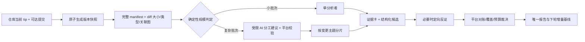

# AI 分析全链路复测与强制改造指引（2026-09-23）

> 适用范围：当前本地平台的周版本 AI 分析。平台尚未正式部署，**允许改表、改任务协议、重建测试库与测试仓库；不为旧运行记录做兼容层**。后续执行 AI 必须按本文的依赖顺序实施，不得只改提示词、调大预算或减少分片数后宣称问题解决。本文是实施任务书；发现与推测分别标注。

## 1. 已复核的事实

入口为 `/weekly-version-config/3/diff`，项目 2、配置 3，当前页面显示 3 个变更文件。正常页面点击“AI分析 → 全量重新分析 → 开始全量分析”创建了 job 18 / run 45；启动前已重启本地 8002 服务。预估 886,232～1,304,305 token、21～26 分钟，说明平台知道小批次将执行昂贵的固定计划。

上一轮同配置的 run 44：5 个分析分片 + 汇总 + 对账，**串行** 7 个角色、34 轮、97 次上下文索取；输入 768,797、输出 274,647，总计 1,043,444 token，缓存读取 652,800，耗时 21 分 8 秒，最终 2 条风险。逐轮 `duration_ms` 之和 1,265,681 ms，接近整个运行的 1,268,263 ms；主要耗时在模型调用链，不在本地 diff 生成或排队。run 37（当时只给 1 个 delta 文件、3 分片）15 轮、291,169 token、5 分 7 秒，只报 1 条风险；两个运行输入范围不同，**不得把它们直接当作模型质量 A/B**。

| run 44 阶段 | 轮次 | 输入 token | 输出 token | 模型耗时 |
|---|---:|---:|---:|---:|
| S1 | 3 | 51,440 | 22,851 | 105 秒 |
| S2 | 6 | 136,895 | 61,844 | 279 秒 |
| S3 | 5 | 130,661 | 43,700 | 205 秒 |
| S4 | 5 | 120,768 | 35,964 | 155 秒 |
| S5 | 8 | 155,254 | 51,917 | 249 秒 |
| 汇总 | 4 | 118,702 | 39,725 | 184 秒 |
| 对账 V1 | 3 | 55,077 | 18,646 | 89 秒 |

S2、S5 各自已经接近 20 万 token；分片高消耗没有带来同等数量的独立文件证据，因为文件总共只有 3 个。S2/S4/S5 的 `unparsable` 又各浪费了一轮。

run 44 的工具账：`file_diff` 18 次调用/3 次实际取数，源内容合计 **9,676 字符**；`file_content` 16/5，其中 14 次未限定内容范围；`read_reference` 21/6，回放 73,526 字符；`find_references` 20/7。三个变更文件都取到过证据，完整性为 3/3；多个角色重复审阅同样的 3 个文件。输出 token 占总 token 的 26.3%，按项目价格表其费用高于缓存输入费用。上游的 `completion_tokens` 可能包含推理 token，但当前 `ChatResult` 不留 `completion_tokens_details`，**不能仅凭截成 4,000 字的 trace 正文断定可见文本产生了全部输出 token**。

**P0：当前测试仓库输入已失真，必须先修。** `origin.git` 的 master 现在只有 `d77366f5`、`80ae9a57`、`0802a44a` 三个提交，`repository.last_synced_tip` 也为 `0802a44a`。但配置 3 的 `weekly_version_diff_cache` 仍指向 `e54c73df`、`aa3fd90b`、`2971caf7` 等不在当前远端历史中的提交；三个缓存行的 `commit_ids` 并集有 **9 个**，单行分别有 5/6/6 个。`commits_log` 同时保留新旧历史，`process_weekly_version_sync` 按仓库 ID 和时间直接取全部行（`services/weekly_version_logic.py`），没有按当前 branch tip 的可达集合过滤；已完成的周期同步也没有清掉这些旧缓存行。run 44 以及正在执行的 run 45 因此可用于分析**当前页面行为/成本**，不能作为当前远端代码的准确率证明。还要区分另一处独立的口径错误：`change_set.from_weekly_payload` 按每个文件的 `latest_commit_id` 分组，所以报告称“3 个提交”；合并 diff 的出处却说覆盖 5/6 条，二者描述的不是同一个提交集合。

现有 `docs/AI分析待修问题与修复方案.md` 中“重开抽屉不刷新/分片顺序”已落地；协议信封处理和纠正额度仍是方案，不是已修。run 44 的 S2/S4/S5 各出现一轮 `unparsable` 后恢复。最新 run 45 的**汇总第 1 轮**再次出现相同形态：响应是 6 个 `evidence` 的全角 DSML `invoke`，没有 JSON；纠正提示还把这段错误信封原样抄回模型。下一轮恢复索取，但白花了 1 轮。不要把恢复等同于协议问题已解决。

## 2. 必须实施的目标架构

**计划由平台掌控，AI 只可在复杂批次提出建议。** 先从冻结快照计算文件数、实际渲染后的 diff 字符数、单文件最大值、二进制/表格/代码比例、关键路径、跨仓库/同提交/名称关联及截断状态。不能按仓库大小或用户提示词预算决定分片数。小批次初始规则建议 `文件≤8 且可渲染 diff 总量≤80,000 字且无单文件超限` 时直接单分析者；3 文件的配置 3 必须命中。阈值是**待基准校准的初值**，不是“8 个文件天然安全”的事实。若有关联图显示跨模块高风险，单分析者仍需检查全部 QA 维度；开启子代理开关时可对高风险候选再做一次独立定向反证，显式关闭时由同一分析者在末轮自查，不得暗中追加第二个角色。

超过小批次门槛后，先按文件/提交/生成物/引用关系构造确定性变更簇；只有簇太大或归属不清时，允许 **1 次**受限规划模型调用。规划输入为元数据、diff 摘要与关联图，不输入整表；返回固定 JSON：`{groups:[{id,paths,objective,qa_dimensions}], shared_paths, reason}`。平台校验所有文件至少被分配一次、关键依赖可共享、路径全在快照内、分片不空、总数不超过上限；无效 JSON、超时、越权路径一律退回确定性分组。不要让模型自己创建无限分片、无限轮次或提升总预算。分片目标由**独立变更簇与证据体积**推导，QA 维度是检查清单，不能再把 9 个维度机械均分成 5 个角色。用户配置的 580,000 字提示词预算是**上限而非用满目标**；当前 `derive_family_sizing` 却主要从这个上限反推每片约 50 次索取，即使只有 1,597 字 diff 也维持 5 片，这个因果方向必须改掉。

多分片仍保留共享提示词前缀与证据缓存。是否并行要用实测的延迟/缓存价/数据库负载作决策；当前顺序执行是为了跨成员命中缓存，直接改成并发会使首轮同时 miss。若启用并发，先预热只读公共前缀，成员各自使用独立数据库会话，并限制并发度。不要把速度提升作为牺牲证据覆盖或破坏快照一致性的理由。

## 3. 按依赖顺序交付的工作包

### A（P0，先完成）：仓库可达性、缓存和快照一致性

修改 `services/repository_sync_window.py`、`services/weekly_version_logic.py`、`services/ai/snapshot_store.py` 与分析启动闸门。同步时从当前 tip 批量取可达提交集合并记录其指纹；周版本只消费当前 tip 可达且落在窗口内的提交。检测到强推、回退或重建裸库后，原子替换该仓库当前窗口的提交索引和 diff 缓存，删除本窗口不再出现的文件行，旧快照保留为历史运行的冻结输入；不能将旧 `commits_log` 与新历史按时间混合。分析启动前核对仓库/分支/tip、可达集合指纹、周版本同步代次与快照来源指纹；**只比 tip 不够**，本次实测正是 `repository.last_synced_tip` 已等于远端 tip、缓存却仍包含旧提交。任一不等，或任一缓存行的提交不在可达集合，就先同步或明确失败，不得默默分析旧缓存。`file_diff` 的 API 语义改成“快照条目/窗口合并差异”，不要再用 `latest_commit_id` 冒充整段差异的提交归属；`commit_detail` 白名单覆盖该窗口的真实可达提交。模型可见摘要要区分“实际提交数”“文件最新提交数”“每文件合并差异覆盖的提交数”。

验收：把 fixture 从 9 提交重置成 3 提交并同步，配置 3 的缓存、manifest、页面、模型允许的 commit 集合均只包含当前历史；再次强推同时间戳的新 tip 也能使快照失效。启动运行时修改仓库 tip，不允许本次读到一半新一半旧；新任务等待新快照。正常无变化的周期同步仍走快速路径。**A 未绿之前禁止用配置 3 的模型报告做准确率结论。**

### B（P0）：计划选择与有界预算

在 `services/ai/auto_sizing.py` 增加纯函数 `plan_analysis(snapshot_facts, effective_budget, dimensions)`；`services/ai_analysis_service.py` 的单代理/家族分支以及 `services/ai_usage_service.py` 的预估必须读取**同一份已持久化计划**，不能各推一次。计划至少落 `plan_version`、快照指纹、模式、分组、每成员轮次/索取/输出上限、总 token 上限、预留给报告收尾的额度和原因。配置 3 的同一份输入自动选择单分析者；大型版本可以选择 2～5 个变更簇，按簇而非维度分工。手动配置“关闭子代理”必须强制单代理，不能被自动规划打开；建议把 `DEFAULT_SUBAGENT_ENABLED` 改成 `False`，并修正 `subagent.py`/`ai_analysis_service.py` 里与实际常量矛盾的注释。老项目现有显式 `True` 可在未正式部署环境直接迁移为新默认，由管理员主动开启。`analysis_revision` 必须包含 diff/快照、提示词、证据协议和规划版本；任一变化时增量入口在调用模型前提示“基线口径已变，建议全量重算”，由用户选择，不得在 worker 内静默升级或复用旧结论。

目前“未设置项目预算”落到 1 亿 token/月，但这**不是单次上限**，且 token 未上报时闸门会放行。新增单次硬上限：建议初始为小计划 150 万、大计划 800 万 token，用户可显式改；模型调用前做“已花 + 本轮保守预留 + 收尾预留”检查，超过时停止探索并产出带缺口的报告。按项目价格表同时换算单次费用预警；用户配置了单次费用上限时取 token/费用两者更早触发的一档。没有价格表不能编造 ¥0 或一个跨模型通用金额，仍由 token 硬上限保证有界。上游缺用量时以请求字符和配置的输出上限做保守估算并标记估算，不能把未知当 0，也不能无限放行。轮次/索取数仍有独立硬上界。阈值及估算公式需在 UI 预览和落库计划中可见。

验收：3 文件计划只执行一个主分析者，输出仍覆盖全部声明的 QA 维度；500+ 文件计划有完整分工且总预算有限；预估/实际计划字段一致；预算不足时报告可读、已查和未查分开、不会新增下一次模型调用。旧 run 42 的 `worker_interrupted` 等部分运行不得进入“最近完整运行”的预估样本。全量模式预览的“基线 run”应显示“全量不使用基线”，不能显示“还没有可复用基线”。

### C（P1）：协议偏航与纠正轮

按现有问题文档 §一的保守路径实施：`protocol.py` 仅对带明确协议请求 JSON 的 DSML 信封抽取 `requests`；纯 `think`、未知工具名、普通正文返回 `None`，走纠正提示。抽取结果仍经过 `parse_payload → sanitize_requests → ground_payload`，不允许信封绕过白名单。`engine.py` 同一轮只 `_emit` 一次；纠正提示不要回显整段错误信封。给输出通道错位一次独立且**计入总轮次**的纠正机会，现有 2 次协议纠正额度留给截断/JSON 结构错误。若上游能提供原生 `tool_calls`，先记录其存在与形状，再决定是否支持；绝不能把未知信封当成可信工具调用。

验收使用现有文档中的 S2、S4、run 38 V1 原文样本：S4 可恢复合法请求且非法地址被拒；S2 纯思考只能重问；普通 JSON/Markdown 不误识别；连续偏航最多消耗有界轮次，trace 明确标记“修复/纠正/失败”，抽屉显示下一轮的纠正原因。

### D（P1）：质量优先的证据与输出压缩

小批次在第一次模型调用前把三份**缓存中的合并 diff** 按长度装进首轮证据包；超长文件只给目录、hunk/表格行摘要及可索取地址。默认 `file_diff` 优先，只有判断需要同表分布、上下文调用方或 diff 无法回答的前提时再读 `file_content`；整表读取要记录触发理由、行范围和实际字数。生成物/调用方搜索只覆盖真实快照范围，并把“未索引/仓库外”明确写为未知。对同一份小文件跨成员重复取数，证据卡引用稳定 `evidence_id`，汇总层读卡片与必要原件，不重放整份参考资料。特别要改掉隐藏截断：`utils/content_window.CONTENT_MAX_CHARS` 固定 11,000，`derive_tool_limits` 单条最多 32,000，`budget.DEFAULT_MAX_ITEMS` 固定 40；用户即使把提示词预算调到很高，正文仍先被 11,000 字夹住。把大文件读取改成可继续的行/hunk 分页，回执带 `total_chars`、`returned_range`、`next_cursor`、`truncated`，并在计划与报告中展示真正生效的上限；不得只把 11,000 改成更大的常数。

协议把中间轮限制为“请求清单或候选证据卡 + 极短理由”，分片只写自己负责维度与具体证据，**不要让每个分片都输出九个维度的 `hit:false`**；平台按责任表补齐未覆盖维度。最终七章报告只由最后的主分析者写一次。增加逐轮 `visible_response_chars`、上游若提供的 `reasoning_tokens`、角色、工具重放字符、截断/纠正原因与成本；未上报字段存 `null`。先在 fixture 与大版本金标上测召回/误报，再逐步收紧各角色 `max_output_tokens`，**不得仅凭 token 下降通过验收**。

验收金标至少包含配置 3 的“50 级蓝耗归零”“新技能数值待平衡”以及“`>50` 注释称有意，不能凭注释断言已消除 50 级问题”；检查 3/3 diff 证据、报告中的触发条件/QA 用例、无无证据高置信结论。大版本维持基准发现集与证据覆盖，逐轮对比输入、输出、费用和耗时。若压缩导致金标漏报或 `finish_reason=length` 增多，撤回该压缩项。

### E（P2）：运行可观测性与恢复

`ai_analysis_trace` 当前到整次完成才批量落库；运行中只靠 `ai_analysis_job.progress_json` 的最近窗口，无法稳定统计每个分片。每轮结束事务写独立事件（`job_id/run_id/member/round` 唯一键），进度 JSON 只做 UI 快照；重启后按事件恢复，不重做已完成的模型调用。每个成员、汇总、复核分别显示输入/输出/缓存、工具请求/执行/失败/截断、耗时和候选数。SSE 断开再连从数据库补快照；现有抽屉排序修复保留。用量页继续显示已落库历史值，同时标注“当前任务未实时统计”；未上报与零要分开。

验收：中途杀 worker、重启、重新打开抽屉，已完成的轮次与 token 账不丢、不重复计费；同项目两个请求只产生一个活动 run；SQLite 下不在模型调用期间持有写事务。需要更高并发时再评估 PostgreSQL，先不要把数据库迁移当作速度问题的捷径。

## 4. 执行顺序与复测记录要求

执行 AI 可并行准备 C/D 的测试与样本，但 **A → B → D 的集成验收必须串行**：输入错误时任何质量比较都不可信；计划变化后输出压缩的对照也必须重测。C 可独立实现，合并前跑协议回归。E 的 schema 与事件 API 可独立开发，最终一起做断点恢复实测。每个工作包提交时附测试、运行记录和实际结果；不能用 mock 的 token 降幅代替真实模型质量。

复测固定两组：① 配置 3 的当前远端 3 提交/3 文件，小批次全量 + 新增 1 提交后的增量；② 配置 1 的大版本，全量或冻结快照重放。每组保存快照指纹、实际 commit 数/文件数/渲染 diff 字符数、计划、逐角色轮次/token/缓存/费用/耗时、工具执行与截断、文件证据覆盖、候选去向、最终风险和金标命中。对照只在**同一快照、同一模型、同一提示词版本、同一价格表**上成立；差异必须说明是随机波动还是计划改动。完成后从页面点击触发，盯到终态，再核对导出 md、历史记录、用量页和重开抽屉。

## 5. 本轮实测补录

run 45（job 18）为最新代码的正常页面触发，已成功结束：5 分片 + 汇总 + V1，共 33 轮、111 次上下文索取，输入 733,484、输出 246,426、缓存读取 615,680、总计 **979,910 token**，耗时 1,125,010 ms（18 分 45 秒）。逐阶段如下；汇总有 1 轮 `unparsable`，其余阶段无协议失败。

| 阶段 | 轮次 | 输入 | 输出 | 模型耗时 |
|---|---:|---:|---:|---:|
| S1 | 3 | 51,480 | 26,745 | 120 秒 |
| S2 | 5 | 108,237 | 47,423 | 206 秒 |
| S3 | 6 | 148,670 | 51,994 | 244 秒 |
| S4 | 5 | 117,833 | 38,228 | 174 秒 |
| S5 | 5 | 116,060 | 33,778 | 155 秒 |
| 汇总 | 5 | 111,380 | 24,469 | 116 秒 |
| V1 | 4 | 79,824 | 23,789 | 107 秒 |

页面与落库显示 2 条高风险，3/3 文件取得证据，导出 md 链接正常；报告命中「50 级蓝耗归零/51 级反跳」和「陨石术待平衡」两个 fixture 金标，并且没有听从代码注释里对评审者的指令。**这只验证当前缓存输入上的模型行为**。报告也亲自指出“清单 3 提交、差异出处 5/6 提交”矛盾；实际是 A 所述旧历史混入。`file_diff` 19 次调用仅 3 次取数，`file_content` 17 次调用/7 次取数，其中 11 次无明确范围；`read_reference` 23 次调用/8 次取数，跨成员回放 78,570 字符。可见 diff 被使用，但大量 token 花在重复取证、长输出和多角色串行上。

**报告还有事实约束问题，应纳入 D 的验收。** “蓝耗归零”代码事实成立，但 50 级是否可达未知，不能直接判为线上已可触发；陨石术两项都是表内最大值及备注待平衡，属于明确 QA 风险，不能仅凭倍率断言“会直接打破平衡”。报告还建议必须在两个进程验证、称配表与代码为两个提交并给出拆分回滚顺序，当前快照及项目知识都没有支撑这些具体发布事实。实施时把报告断言拆成`已证实代码/配表事实`、`需确认的上线前提`、`建议测试`，高置信度结论必须逐项有快照证据；程序性建议也不得补写无来源的项目架构。

单代理对照从页面新建 job 19 / run 46；仅暂时将项目 2 的 `subagent_enabled/subagent_verify` 从 `1/1` 切为 `0/0`，其余配置未变，结束后已恢复 `1/1`。run 45 与 run 46 的冻结输入同为 snapshot 19，`content_digest=9c93ec9d88687feff26b5c01338989c7796814c4`，模型、提示词/技能/规则版本相同。预览显示理论上限 1 角色、8 轮/40 次索取，但仍按历史多代理运行给出 708,986～1,043,444 token、17～21 分钟；实际只花 114,333 token/3 分钟，预估没有按计划模式筛样本。

| 同快照全量 | 角色/轮次 | 上下文索取 | 输入/输出 token | 总 token | 耗时 | 费用估算* | 金标 |
|---|---:|---:|---:|---:|---:|---:|---:|
| run 45 多代理 | 7/33 | 111 | 733,484 / 246,426 | 979,910 | 18 分 45 秒 | ¥2.330 | 2/2 |
| run 46 单代理 | 1/4 | 11 | 76,058 / 38,275 | 114,333 | 2 分 59 秒 | ¥0.346 | 2/2 |

*按当前项目 v2 单价（每百万 token：输入 ¥2、缓存输入 ¥0.2、输出 ¥8）计算，接口不直接上报金额。单代理 token 低 **88.3%**、耗时低 **84.1%**、估算费用低 **85.2%**；两者都取得 3/3 文件证据、保留 2 条核心风险。run 46 仅 `file_diff` 3 次、`file_content` 3 次且无无范围整表请求；多代理则是 19/17 次，重复索取非常明显。run 46 还按每秒输出比较陨石术与火球术，主动把“必然超模”降为“数值未平衡待策划确认”，这个反证比 run 45 的单纯倍率断言更审慎。**但一个 fixture 的 2/2 不能证明小批次策略永不漏报**；B/D 的质量门槛仍需多版本金标和误报检查。

run 46 也有事实外推：把“50 级”写成“满级”，尽管等级上限未知；在「上线与回滚关注点」断言配表/代码必须同批上线、否则冷却会立刻差 1000 倍，然而已知的换算函数当前没有查到调用点；跨服、投放报警和多进程建议也缺项目事实来源。D 的实施必须把“可作为通用 QA 用例”与“本项目已存在该功能/架构”的陈述分开，对后者要求证据；不能因单代理更省钱就忽略这些质量问题。

用量页在运行中保留历史缓存命中率/费用并提示当前任务未计入，终态刷新后显示 83.2% / ¥115.34，没有把历史 KPI 改成“未上报”。run 45/46 的完整结论与导出 md 链接都在抽屉中可见。两次运行的输入均含 A 所述旧历史，**当前远端的准确率验收必须等待 A 修复后再做**。
