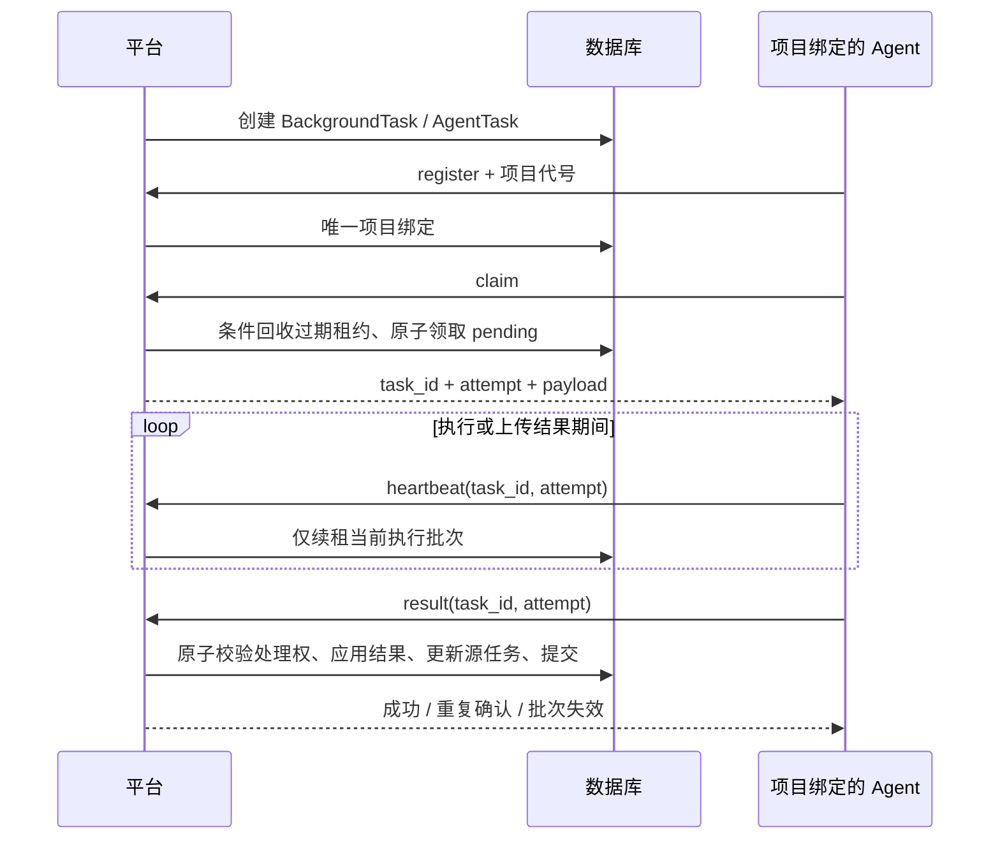

# 配置表 Diff 工具：多节点分布式实现审计与修复报告

审计日期：2026-09-16。审计基线：`23559af`，修复代码与本报告一同提交。

## 1. 结论

项目已经实现配置/代码仓库的采集、文件差异、确认流转、周版本聚合，以及数据库任务队列驱动的 Agent 执行。分布式模型是**按项目静态分配到节点**：一个项目只能绑定一个 Agent，一个 Agent 可以绑定多个项目。不是同一项目下多个节点共享任务、自动负载均衡或自动故障转移。

本次修复集中在任务租约和结果提交的一致性：过期任务回收竞态、迟到结果覆盖、重复回传副作用、未领取任务提交结果、长任务阻塞心跳、回传重试凭据过期，以及同步结果的中途提交。新增真实数据库回归和运行循环测试。

仍存在需要后续改造的架构缺口，尤其是“仅部署 agent 目录即可完成所有 Diff”的部署描述与实现不一致。**本次修复不等于已经完成独立计算节点解耦，也不保证任务执行 exactly-once。**

## 2. 整体实现

| 层次 | 主要文件 | 职责 |
|---|---|---|
| Web 入口 | `app.py`、`bootstrap/*`、`routes/*` | Flask 初始化、路由、权限和运行模式 |
| 仓库采集 | `services/git_service.py`、`services/svn_service.py`、`agent/handlers/auto_sync.py` | 拉取 Git/SVN 历史，形成提交及文件记录 |
| Diff | `services/commit_diff_logic.py`、`services/diff_service.py` | 前序版本定位、文本/Excel 等差异计算 |
| 缓存 | `services/excel_diff_cache_service.py`、`services/excel_html_cache_service.py`、`agent/local_temp_cache.py` | 结构化 Diff、HTML 和节点临时结果缓存 |
| 周版本 | `services/weekly_version_logic.py`、`services/task_worker_service.py` | 时间窗口聚合、定时同步、后台计算 |
| 分布式控制面 | `services/agent_management_handlers.py`、`services/agent_task_result_service.py` | 注册、项目绑定、领取、心跳、结果落库 |
| 执行面 | `agent/runner_runtime.py`、`agent/executor.py`、`agent/handlers/*` | 串行领取任务、本地执行、回传及失败重试 |

`DEPLOYMENT_MODE=single` 采用本地工作线程；`platform/agent` 的任务分发判断由 `services/deployment_mode.py` 统一。标准 Agent 入口 `agent/start_agent.py` 使用 `runner_runtime.py`，仓库中另有 `runner.py` 旧循环，本次同步添加了批次字段和执行期间心跳。

Excel/CSV 比较遵循现有字符串原样读取口径；本次没有调整单元格比较规则或确认业务。

## 3. 多节点任务链路

关键约束：

- `AgentProjectBinding.project_id` 唯一，领取范围由绑定项目决定。
- 任务按 priority、created_at 排序。一个运行循环一次执行一个任务。
- 领取租约默认 120 秒，平台限制为 30–600 秒。过期回收由后续 claim 触发。
- 已有 pending → processing 条件 UPDATE 防重复领取；本次补齐回收和回传两端的原子条件。
- 大结果可能先保存在节点，通过 `temp_cache_fetch` 再传到平台；因此节点本地缓存也是可用性依赖。

## 4. 已修复问题

### 4.1 P1：回传没有执行批次和状态保护

原结果接口只在 assigned_agent_id 非空时检查归属，并无 processing 前置条件。未领取任务可以被提交结果；同节点旧执行在任务回收重领后仍能覆盖新执行；completed 和 failed 也可以互相覆盖。

修复：严格检查所属节点，以已有 retry_count 作为回收代次并在 claim 返回 `attempt`。结果通过 `id + assigned_agent_id + processing + attempt` 条件 UPDATE 获取处理权，失败返回 409。同批次同终态重传返回成功及 `duplicate=true`，不重新应用数据或增加源任务重试次数。

这是执行批次标识，不是安全令牌。节点身份仍由共享密钥和 Agent token 验证。

### 4.2 P1：过期回收使用旧快照覆盖并发续租或完成

原实现先查询过期对象，再逐个设置 pending。查询后若其他请求完成或续租，旧对象仍可能覆盖新状态。

修复：回收 UPDATE 自身重新检查 processing、所属项目及过期时间，在数据库中原子增加 retry_count。没有过期任务时跳过写操作，避免空轮询无谓占用 SQLite 写锁。

回归使用另一条数据库连接，在回收读写间隙先续租，确认当前请求不会回收该任务。另一个双连接用例确认并发完成的获胜结果不会被重复应用。

### 4.3 P1：长任务阻塞节点心跳

原运行循环同步调用 execute_task，期间不会发送心跳，也没有租约续期。耗时计算、仓库拉取和上传结果期间，节点可能被误判离线，任务可能被重领。

新增 `agent/task_heartbeat.py`：执行及缓存上传期间由独立线程续租，间隔最多 30 秒；退出上下文时停止线程。平台续租也要求任务所属节点、processing 状态和 attempt 匹配。临时网络异常后继续尝试。

租约到期但尚未回收的同一批次仍允许续租或提交；回收代次一旦增加，旧批次不能恢复所有权。网络分区期间旧计算不一定能被取消，最终回传由批次校验裁决。

### 4.4 P1：回传重试可以永久卡住节点

增强运行循环原先保存旧 agent_token；身份失效后即便重新注册，待回传 payload 仍使用旧 token。对已删除任务或已经失效的结果也会持续重试，阻塞领取后续任务。

修复：补回传使用当前凭据并续租；403（不再属于本节点）、404、409 视为终止性结果，记录日志后释放待回传槽位。401 走重新注册，网络错误和服务器错误保留退避重试。

### 4.5 P1：auto_sync 结果处理破坏事务边界

`_apply_auto_sync_result()` 在派发周版本任务时调用 `create_weekly_sync_task()`，后者会直接 commit。若后续更新源任务或仓库状态失败，之前任务状态和提交记录已提交，外层 rollback 无法撤销。

修复：创建周版本任务增加 `auto_commit` 参数，默认行为不变；结果应用传入 False，将提交权交给外层。此模式下错误向外传播，不在内部吞掉异常或回滚后继续执行。故障注入用例证明周版本任务派发后抛错时，AgentTask 和提交记录一起回滚。

## 5. 尚未修复的架构问题及处理建议

以下为代码审计确认的限制或风险，未作为本次局部一致性修复的一部分完成。

| 优先级 | 问题与证据 | 影响及建议 |
|---|---|---|
| P1 | `agent/executor.py` 的 Excel/周版本分支及 `agent/handlers/commit_diff.py` 会寻找父目录 app.py 并导入平台服务；`agent/build_zip.py` 只打包 agent 目录 | 独立包可进行 auto_sync、缓存取回，但缺少完整平台时无法完成这些 Diff 任务。应将计算核心独立出来，任务携带输入快照，结果统一由平台落库；在此之前必须明确完整源码及依赖要求。 |
| P1 | Diff 本地运行时按平台记录 ID 查数据库，部分缓存操作直接写库 | 多节点各用独立 SQLite 会缺少记录；共享数据库又扩大节点写权限，并使执行期间写入绕过结果批次校验。需将计算与持久化分离，不能宣称仅凭 HTTP 连接即可完成全链路。 |
| P1 | auto_sync 使用 `AGENT_REPOS_BASE_DIR`（默认 agent_repos），`GitService._get_local_path()` 默认使用 repos；相对路径还受工作目录影响 | 同步成功不代表后续 Diff 能找到同一工作副本。应统一绝对路径解析和节点仓库目录，不依赖默认目录巧合一致。 |
| P1 | `_ensure_agent_dispatch_for_background_task()`、`_ensure_commit_diff_task()` 采用先查后插，没有覆盖业务请求键的数据库唯一约束 | 多平台进程或并发请求仍可能产生不同任务行、执行同一业务；本次只能防止同一任务行的重复回传。建议唯一请求键或独立幂等表，调度器采用单实例/领导者锁。 |
| P2 | 项目唯一绑定，回收只在绑定项目的节点 claim 时触发 | 节点永久下线时，其他 Agent 不会接管。需要明确项目迁移流程、仓库重建及缓存失效，或设计可执行节点池后再引入自动转移。 |
| P2 | 过期回收无最大代次/死信策略；pending_report 只存在进程内 | 永久失败或反复中断可能无限重试；进程退出会丢失未确认回传。建议持久化本地结果 outbox、重试上限、失败原因分类及人工恢复入口。 |
| P2 | `weekly_ai_analysis` 可进入 AgentTask 分发分支，但 executor 没有对应接收分支；claim 不按任务能力过滤 | 节点可能领取不支持的任务并报失败。应明确 AI 任务留在平台还是扩展 Agent 执行，并让分发与能力协议一致。 |
| P2 | `_upsert_agent_temp_cache_entry()` 使用上传者提供的项目/仓库、大小和摘要，未完整交叉验证任务归属和真实内容 | 节点误配置或受损时存在跨项目缓存污染、摘要/大小不一致风险。应校验绑定与任务关系，按实际字节计算摘要/长度，并添加唯一冲突处理。 |

推荐后续顺序：先解决独立 Agent 运行依赖及仓库路径，完成真实两节点部署验收；随后补业务任务唯一性和能力匹配；最后再扩展自动转移、死信与持久化回传。直接增加 Agent 数量不会自动解决这些问题。

## 6. 协议兼容与上线方式

无需增加数据库字段或迁移表；attempt 使用现有 retry_count，禁止运维对活动任务手工清零该字段。需要同时部署平台和新版 Agent。

为兼容在途旧任务，缺少 attempt 按 0 处理，仅能提交尚未回收的首批任务。已经回收的任务必须由新版 Agent 回传正确 attempt；旧 Agent 不应长期混用，否则可能停在回传重试。

建议先停领并排空节点任务，更新平台，再更新全部节点，然后恢复领取。此次 Git push 只提交源码，不执行生产部署或自动发布 Agent release。

仍需人工检查 Agent 使用唯一身份、完整运行环境、正确数据库和仓库目录。当前标准部署应按静态项目分配使用，暂不以多平台实例加多 Agent 的方式宣称高可用。

## 7. 验证范围

新增测试覆盖：未领取结果拒绝、终态不可覆盖、重复失败回传幂等、同节点过期批次隔离、当前批次续租、事务失败回滚、回收与续租竞争、并发回传、阻塞执行期间心跳、心跳临时断网恢复，以及运行循环在 401/403/404/409/500 下的恢复行为。

测试数据库由 tests/conftest.py 隔离到 `.pytest_tmp/db`，没有使用生产数据库。最初新增的五个数据库回归全部失败，修复后通过；事务故障注入也先复现了错误提交，再验证回滚。

提交前定向回归：154 passed（含本次变更相关的八个测试文件）；增量 Ruff 检查通过；文件长度守卫无超限错误，有两个现有大文件的长度提示。

首轮全量测试：1707 passed、1 skipped、2 failed。两个失败分别是旧查询桩未区分过期任务查询，以及源码字符串断言固定了旧函数签名；已更新，并包含在上述定向通过结果中。按用户要求先提交已发现问题及修复，报告不据此宣称全量测试全部通过。

验证基于本机 Python 3.13、SQLite 和模拟 HTTP；没有执行真实多主机断网、MySQL 并发锁语义、进程强杀或大仓库压力测试，不能以单元测试结果代替生产分布式验收。
