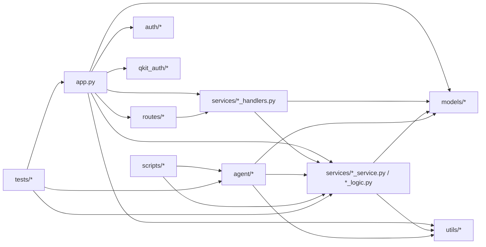

# 代码架构说明

本文聚焦“代码层面”的结构与实现方式，帮助研发快速理解当前项目。

关联文档：
- 平台部署与配置：[`平台配置说明.md`](./平台配置说明.md)
- 快速入口说明：[`README.md`](./README.md)

---

## 0. 架构图版（Mermaid）

### 0.1 端到端流程图

```mermaid
flowchart TD
    U[用户浏览器/调用方] --> APP[Flask app.py]
    APP --> R[routes/* Blueprint]
    R --> H[services/*_handlers.py]
    H --> S[services/*_service.py / *_logic.py]
    S --> M[(models/* 数据库)]

    S -->|创建后台任务| BT[BackgroundTask]
    BT --> TW[task_worker_service]
    TW -->|single模式本地执行| LS[本地任务执行]
    TW -->|platform/agent模式下发| AT[AgentTask]

    AG[Agent runner_runtime] -->|register/heartbeat/claim| API[/api/agents/*]
    API --> H
    AG --> EX[agent/executor.py]
    EX --> AH[agent/handlers/*]
    AH -->|结果回传| API

    PUB[scripts/publish_agent_release.py] --> ARS[services/agent_release_service.py]
    ARS --> REL[(instance/agent_releases)]
    AG --> SU[agent/self_update.py]
    SU -->|check latest/download/apply| REL
    SU -->|完成后重启| AG
```

### 0.2 模块依赖图



---

## 1. 架构总览

项目是一个 Flask Web 应用，核心职责分为三层：

1. 控制层（Routes / Handlers）
- `routes/*`：注册 Blueprint 路由
- `services/*_handlers.py`：路由对应的处理逻辑（参数解析、鉴权、业务编排）

2. 领域服务层（Services）
- `services/*_service.py` 与 `services/*_logic.py`：仓库同步、Diff 计算、缓存、周版本、任务编排等核心业务

3. 数据层（Models）
- `models/*`：SQLAlchemy 模型，包含项目、仓库、提交、任务、Agent、缓存等实体

另外有两个认证子系统（`auth` / `qkit_auth`）和一个独立 Agent 运行包（`agent/`）。

---

## 2. 运行模式与职责边界

通过 `DEPLOYMENT_MODE` 决定职责：

- `single`
  - 启动 Flask + 本地后台任务线程
  - 适合本地开发或单机部署
- `platform`
  - 启动 Flask，不启本地任务线程
  - 任务下发给 Agent 执行（控制面 + 编排面）
- `agent`
  - `app.py` 进程直接进入 Agent 循环（一般用于调试）

关键入口：
- [app.py](/c:/Users/huangshaojiang/Desktop/配表代码版本diff平台/app.py)

---

## 3. 主要调用链路（实现视角）

### 3.1 Web 请求链路
1. Flask 路由（`routes/*`）收到请求
2. 通过 `services/model_loader.py` 动态分发到 handler
3. handler 调用 service/logic，落库模型
4. 返回 HTML 或 JSON

设计点：
- 路由层尽量薄，业务下沉到 services
- `model_loader` 提供运行时对象解耦（模型/运行时对象统一获取）

### 3.2 任务链路（platform + agent）
1. 平台创建 `BackgroundTask`
2. 在 `platform`/`agent` 分发模式下，映射成 `AgentTask`
3. Agent 心跳 + claim 任务
4. Agent 本地执行并回传结果
5. 平台消费结果并更新业务表

关键文件：
- [services/task_worker_service.py](/c:/Users/huangshaojiang/Desktop/配表代码版本diff平台/services/task_worker_service.py)
- [services/agent_management_handlers.py](/c:/Users/huangshaojiang/Desktop/配表代码版本diff平台/services/agent_management_handlers.py)
- [agent/runner_runtime.py](/c:/Users/huangshaojiang/Desktop/配表代码版本diff平台/agent/runner_runtime.py)

### 3.3 Agent 自更新链路（release 包）
1. 平台执行发布脚本生成 release 包与 latest manifest
2. Agent 周期性请求 latest
3. 若有更新：下载包 -> 校验 SHA256 -> 覆盖 ->（可选）安装依赖 -> 重启
4. 支持管理员接口和脚本回滚 latest

关键文件：
- [services/agent_release_service.py](/c:/Users/huangshaojiang/Desktop/配表代码版本diff平台/services/agent_release_service.py)
- [agent/self_update.py](/c:/Users/huangshaojiang/Desktop/配表代码版本diff平台/agent/self_update.py)
- [scripts/publish_agent_release.py](/c:/Users/huangshaojiang/Desktop/配表代码版本diff平台/scripts/publish_agent_release.py)

---

## 4. 目录与模块说明（重点目录）

### 4.1 平台主目录
- `app.py`
  - 主启动入口、环境初始化、Blueprint 注册、运行模式分流
- `routes/`
  - 路由注册层，按域拆分（仓库、周版本、Agent、缓存等）
- `services/`
  - 业务核心实现（同步、Diff、缓存、任务、Agent 编排、性能指标）
- `models/`
  - SQLAlchemy 模型定义（业务实体 + Agent 实体）
- `utils/`
  - 安全、数据库、日志、重试、env 引导等通用能力
- `templates/` + `static/`
  - 前端页面与静态资源

### 4.2 认证目录
- `auth/`
  - local 账号后端（本地用户名密码、RBAC、审批）
- `qkit_auth/`
  - qkit 账号后端（JWT 校验、回调、项目导入能力）

### 4.3 Agent 目录
- `agent/runner_runtime.py`
  - Agent 主循环（注册、心跳、claim、执行、回传）
- `agent/executor.py`
  - 任务分发器（`auto_sync` / `excel_diff` / `weekly_*` / `temp_cache_fetch`）
- `agent/handlers/auto_sync.py`
  - 仓库同步与提交采集（git）
- `agent/self_update.py`
  - release 包更新与回滚保护逻辑
- `agent/start_agent.sh` / `agent/start_agent.bat`
  - 远端节点一键启动脚本

---

## 5. 数据模型分层（简要）

核心业务模型：
- `Project`（项目）
- `Repository`（仓库）
- `Commit`（提交记录）
- `BackgroundTask`（平台后台任务）
- 周版本相关缓存与配置模型

Agent 相关模型：
- `AgentNode`（节点状态与能力）
- `AgentTask`（下发到 Agent 的任务）
- `AgentTempCache`（Agent 临时缓存）

认证模型：
- `auth_*`（local）
- `qkit_auth_*`（qkit）

---

## 6. 当前实现特点（优点）

1. 功能闭环完整
- 从仓库同步到差异确认、周版本、缓存与任务编排都可闭环运行

2. 模式解耦明确
- `single/platform/agent` 三种模式满足开发、单机、分布式部署

3. Agent 架构可扩展
- 已具备任务协议、心跳、回传、节点管理与 release 自更新机制

4. 测试覆盖较广
- `tests/` 下有多组功能/回归测试，覆盖认证、Agent、缓存、周版本等关键链路

---

## 7. 已知不足与技术债（建议重点关注）

1. SQLAlchemy 2.0 兼容细节尚未完全收敛
- 测试中仍可见 `Query.get()` 的 legacy 警告
- 建议逐步迁移到 `Session.get()`

2. 路由动态分发机制可读性成本较高
- `routes -> model_loader -> handler` 灵活，但新同学定位路径成本偏高
- 建议补充“路由到 handler 对照表”或自动生成文档

3. 发布/回滚流程缺少 CI 自动化
- 当前以脚本手工执行为主，尚未看到内置 CI 流水线文件
- 建议接入 CI 做发布审批、回滚审计、工单关联


---

## 8. 推荐阅读顺序（新同学入门）

1. [`README.md`](./README.md)：先理解产品边界与启动方法  
2. [`平台配置说明.md`](./平台配置说明.md)：掌握部署与配置参数  
3. `app.py`：看运行模式分流与 Blueprint 注册  
4. `services/task_worker_service.py` + `services/agent_management_handlers.py`：看任务编排主链路  
5. `agent/runner_runtime.py` + `agent/self_update.py`：看 Agent 执行与自更新  
6. `tests/test_agent_*` 与关键业务测试：看行为预期与回归样例  

---

## 9. 开发建议（代码层面）

1. 新增功能优先放到 `services/`，避免继续堆叠到 `app.py`  
2. 新接口保持“route 薄、handler 清晰、service 纯业务”  
3. 高风险改动（任务编排/缓存/自更新）必须补回归测试  
4. 对外协议（Agent API、release manifest）保持向后兼容，版本化演进  
5. 关键链路日志保持结构化，便于线上排障（尤其 Agent 更新失败场景）  
